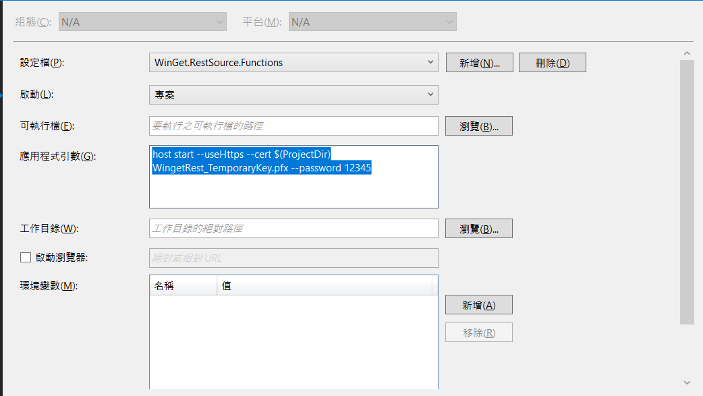

# azure - demo

## MacOS 
### install azure functions tool
```sh
brew tap azure/functions
brew install azure-functions-core-tools@4
brew link --overwrite azure-functions-core-tools@4
```

### Install az cli
```sh
brew update && brew install azure-cli
```

## Azure functions tool commands
```sh
func init
func new
func start &> ~/output.txt &

# 測試 : 輸出是 6300
curl "http://localhost:7071/api/simple-interest?principal=5000&rate=.035&term=36" -w "\n"
curl "https://gogopowerkimi.azurewebsites.net/api/simple-interest?principal=5000&rate=.035&term=36" -w "\n"
```

## Run [microsoft/winget-cli-restsource](https://github.com/microsoft/winget-cli-restsource)



## Reference
* [How to fix Azure functions: Incompatible Node.js version (v16.4.1)](https://stackoverflow.com/questions/70427342/how-to-fix-azure-functions-incompatible-node-js-version-v16-4-1)
* [在 macOS 上安裝 Azure CLI](https://learn.microsoft.com/zh-tw/cli/azure/install-azure-cli-macos)