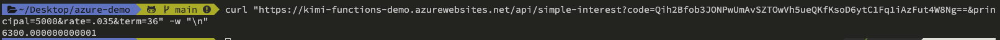

# azure - demo

## MacOS 
### install azure functions tool
```sh
brew tap azure/functions
brew install azure-functions-core-tools@4
brew link --overwrite azure-functions-core-tools@4
```

### Install az cli
```sh
brew update && brew install azure-cli
```

## Azure functions tool commands
```sh
func init
func new
func start &> ~/output.txt &

# 測試 : 輸出是 6300
curl "http://localhost:7071/api/simple-interest?principal=5000&rate=.035&term=36" -w "\n"
```

## 發佈至 Azure  func azure functionapp publish)
```sh
func azure functionapp publish <app_name>
func azure functionapp publish kimi-functions-demo
```
<app_name> 是目標函式應用程式在 Azure 中的名稱，而不是您的專案資料夾名稱，兩者可能會不同

### 測試
將 `&principal=5000&rate=.035&term=36` 新增至 URL 結尾處 (請務必保留 `code` 參數)
`code` 可從`函數應用程式`->`應用程式金鑰`找到

```sh
curl "https://kimi-functions-demo.azurewebsites.net/api/simple-interest?code=<your code>&principal=5000&rate=.035&term=36" -w "\n"
```


## Run [microsoft/winget-cli-restsource](https://github.com/microsoft/winget-cli-restsource)


## Reference
* [How to fix Azure functions: Incompatible Node.js version (v16.4.1)](https://stackoverflow.com/questions/70427342/how-to-fix-azure-functions-incompatible-node-js-version-v16-4-1)
* [在 macOS 上安裝 Azure CLI](https://learn.microsoft.com/zh-tw/cli/azure/install-azure-cli-macos)
* [使用 Azure Functions Core Tools 來開發、測試和發佈 Azure Functions](https://learn.microsoft.com/zh-tw/training/modules/develop-test-deploy-azure-functions-with-core-tools/)