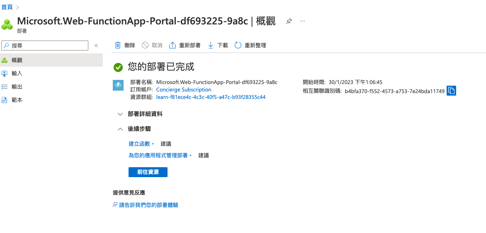
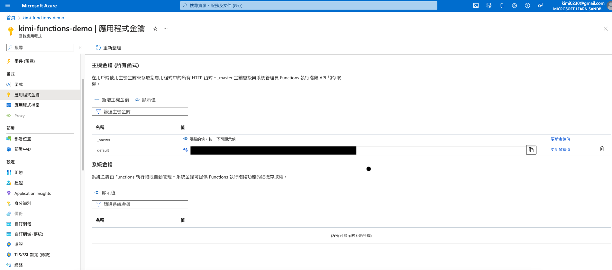

# azure - demo

## MacOS 
### install azure functions tool
```sh
brew tap azure/functions
brew install azure-functions-core-tools@4
brew link --overwrite azure-functions-core-tools@4
```


### Install az cli
[How to install the Azure CLI](https://learn.microsoft.com/en-us/cli/azure/install-azure-cli)

```sh
# Mac
# https://learn.microsoft.com/zh-tw/cli/azure/install-azure-cli-macos
brew update && brew install azure-cli

# Windows 
# https://learn.microsoft.com/zh-tw/cli/azure/install-azure-cli-windows?tabs=winget
winget install -e --id Microsoft.AzureCLI
```


### Login Azure

```sh
az login
```


## Azure functions tool commands
```sh
func init
func new
func start &> ~/output.txt &

# 測試 : 輸出是 6300
curl "http://localhost:7071/api/simple-interest?principal=5000&rate=.035&term=36" -w "\n"
```

### Create and execute Azure functions

1. `func init`
建立新的函式專案


2. `func new`
在函式專案資料夾中執行 func new 將會建立新的函式，以及開始進行開發所需的所有檔案。


3. `func start`
本地測試


4. 去 https://portal.azure.com/#home 新增 functions




5. `func azure functionapp publish`
Deploy to Azure
可以使用 [Azure Sandbox](https://learn.microsoft.com/zh-tw/training/modules/develop-test-deploy-azure-functions-with-core-tools/3-exercise-create-function-core-tools)

沙箱僅可用於完成 Microsoft Learn 上的訓練。 禁止用於其他任何用途，否則可能導致永久無法存取沙箱

去 https://portal.azure.com/#home 開始使用 functions

```sh
# sample
func azure functionapp publish <app_name>

# You're trying to use v3 tooling to publish to a non-v3 function app (FUNCTIONS_EXTENSION_VERSION is set to ~4).
# You can pass --force to force update the app to v3, or downgrade to v1 or v2 tooling for publishing.
# https://github.com/Azure/azure-functions-core-tools/issues/1770
func azure functionapp publish <app_name> --javascript 

# demo
func azure functionapp publish kimi-functions-demo --javascript
```

`<app_name>` 是目標函式應用程式在 Azure 中的名稱，而不是您的專案資料夾名稱，兩者可能會不同


6. `code` 可從`函數應用程式`->`應用程式金鑰`找到



7. Azure functions configuration


8. Call API

```sh
curl https://kimi-functions-demo.azurewebsites.net/api/demo-http-trigger-function?code=wqT6RcBf6nnX16QcljN2OKOXGyD77YkaLYQQlGvdviB0AzFuqwZiAA==
```

## More Example
https://learn.microsoft.com/zh-tw/training/modules/develop-test-deploy-azure-functions-with-core-tools/3-exercise-create-function-core-tools

```javascript
module.exports = async function(context, req) {
  // Try to grab principal, rate, and term from the query string and
  // parse them as numbers
  const principal = parseFloat(req.query.principal);
  const rate = parseFloat(req.query.rate);
  const term = parseFloat(req.query.term);

  if ([principal, rate, term].some(isNaN)) {
    // If any empty or non-numeric values, return a 400 response with an
    // error message
    context.res = {
      status: 400,
      body: "Please supply principal, rate and term in the query string"
    };
  } else {
    // Otherwise set the response body to the product of the three values
    context.res = { body: principal * rate * term };
  }
};
```

將 `&principal=5000&rate=.035&term=36` 新增至 URL 結尾處 (請務必保留 `code` 參數)

```sh
curl "https://kimi-functions-demo.azurewebsites.net/api/simple-interest?code=<your code>&principal=5000&rate=.035&term=36" -w "\n"
```


## Local Run [microsoft/winget-cli-restsource](https://github.com/microsoft/winget-cli-restsource)


## Reference
* [How to fix Azure functions: Incompatible Node.js version (v16.4.1)](https://stackoverflow.com/questions/70427342/how-to-fix-azure-functions-incompatible-node-js-version-v16-4-1)
* [在 macOS 上安裝 Azure CLI](https://learn.microsoft.com/zh-tw/cli/azure/install-azure-cli-macos)
* [使用 Azure Functions Core Tools 來開發、測試和發佈 Azure Functions](https://learn.microsoft.com/zh-tw/training/modules/develop-test-deploy-azure-functions-with-core-tools/)